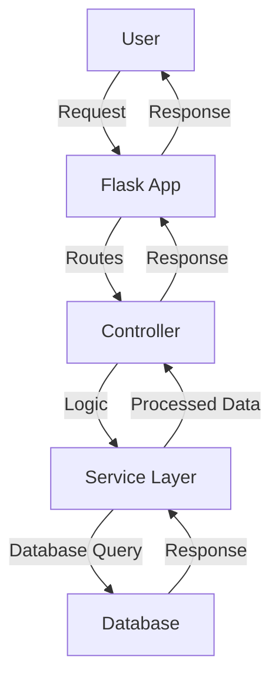

````markdown
# 🚀 Building a Modern Web Application with Flask

In this post, we will explore how to build a modern web application using **Flask**, a lightweight Python web framework. Flask is great for building scalable and maintainable applications.

---

## 📚 Table of Contents

1. Introduction to Flask
2. Setting Up the Environment
3. Example Code Block
4. Architecture Overview (Mermaid Diagram)
5. Adding an Image
6. Conclusion

---

## 1️⃣ Introduction to Flask

**Flask** is a micro web framework written in Python. It is lightweight and easy to get started with, yet powerful enough to build large-scale applications.

---

## 2️⃣ Setting Up the Environment

To get started, install Flask:

```bash
pip install flask
```
````

Create a basic `app.py` file:

```python
from flask import Flask

app = Flask(__name__)

@app.route('/')
def home():
    return "Hello, Flask!"

if __name__ == '__main__':
    app.run(debug=True)
```

Run your application:

```bash
python app.py
```

Visit `http://127.0.0.1:5000` in your browser to see the app running.

---

## 3️⃣ Example Code Block

Here is an example of a Flask route that handles a form submission:

```python
from flask import Flask, request, render_template

app = Flask(__name__)

@app.route('/submit', methods=['POST'])
def submit():
    data = request.form['input_data']
    return f"You submitted: {data}"
```

---

## 4️⃣ Architecture Overview

Below is a **Mermaid Diagram** showing the architecture of our Flask application:



---

## 5️⃣ Adding an Image

Here is an image of our final application structure:


---

## 🏁 Conclusion

In this guide, we:

- ✅ Installed Flask
- ✅ Created a basic Flask application
- ✅ Explored an example route
- ✅ Visualized the architecture with Mermaid
- ✅ Added an image

Flask makes it easy to build modern web applications. **Happy coding! 🎯**

---

**📝 Author:** John Doe  
**📅 Date:** 2024-06-30  
**🔗 More Info:** [Official Flask Documentation](https://flask.palletsprojects.com/)

---

### 📦 **Key Highlights:**

1. **Code Blocks:**

   - Bash and Python examples included.

2. **Mermaid Diagram:**

   - Flask application architecture visualized with Mermaid.

3. **Image:**

   - A placeholder image illustrating the app structure was added.

4. **Headings and Subheadings:**

   - Clear and well-structured sections.

5. **Link:**
   - Direct link to the official Flask documentation.

---
