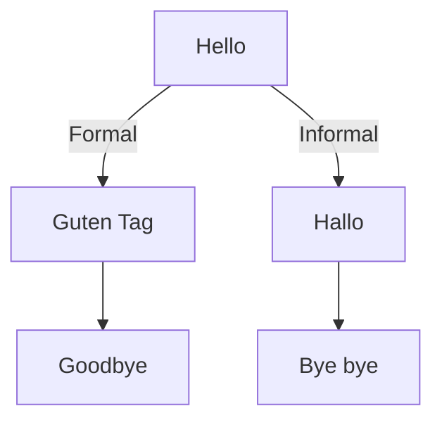

# German Grammar - Basic Concepts

## Articles (Definite and Indefinite)

In German, nouns have genders, and the articles are determined accordingly:

- **Der** (Masculine)
- **Die** (Feminine)
- **Das** (Neutral)

Indefinite articles:

- Masculine: **ein**
- Feminine: **eine**
- Neutral: **ein**

### Examples:

| Article | Example Noun | Meaning |
| ------- | ------------ | ------- |
| Der     | der Hund     | the dog |
| Die     | die Katze    | the cat |
| Das     | das Auto     | the car |

---

## Pronouns (Pronomen)

### Personal Pronouns:

| Person       | German    | English      |
| ------------ | --------- | ------------ |
| 1st Singular | ich       | I            |
| 2nd Singular | du        | you          |
| 3rd Singular | er/sie/es | he/she/it    |
| 1st Plural   | wir       | we           |
| 2nd Plural   | ihr       | you (plural) |
| 3rd Plural   | sie       | they         |

---

## Greetings Flowchart (Mermaid Example)

German greetings can be illustrated using a flowchart:

